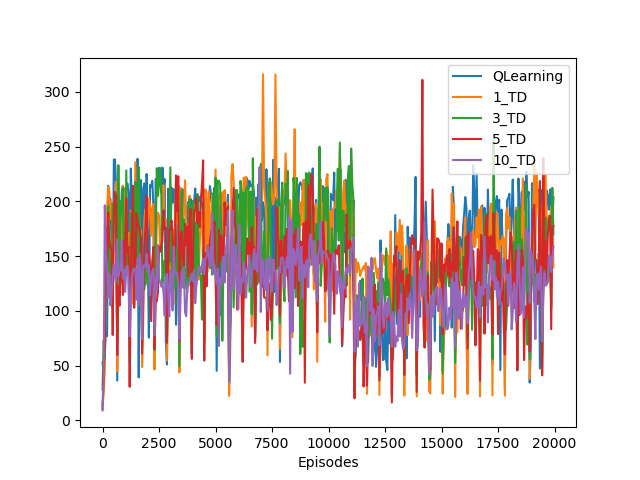
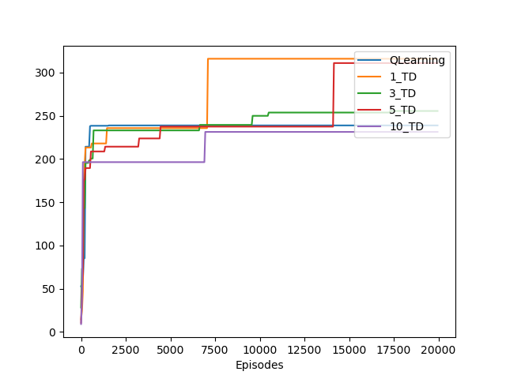
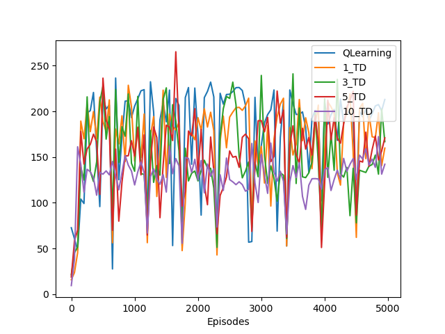
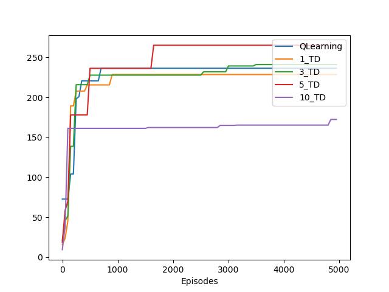
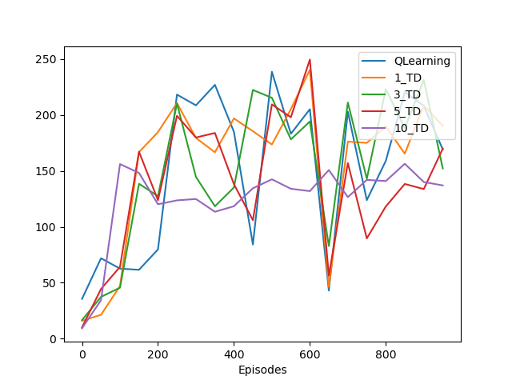
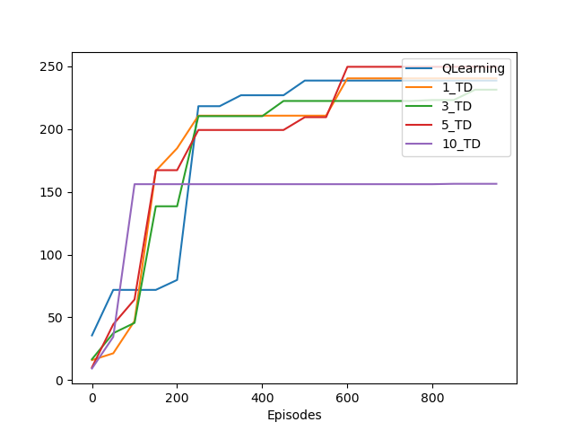
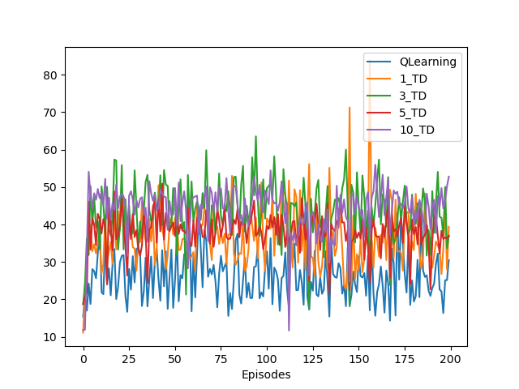
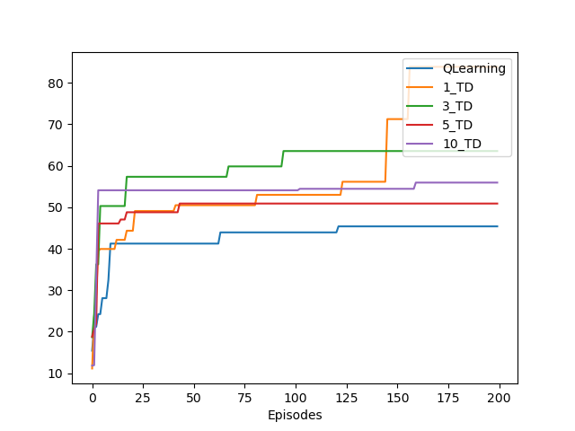

# 《强化学习课程》“倒立摆”实验报告

### 实验要求
在DiscreteCartPole环境上实现n-step TD学习算法，对比不同n（至少3种）对算法效果的影响，撰写实验报告并提交代码。

### 实验过程
见`discrete_cartpole.py`

训练时关掉了render，对`QLearning`算法，`n-step Sarsa`的n = 1(此时应为Sarsa),3,5,10  分别进行了实验

各个超参数基本维持原状，但为了保持n-step时的顺序性，使`batch_size`大小为1，即按顺序更新q值。`gamma = 0.9`,`lr = 0.5`, `episode = 0.05`

总共训练20000个episode, 每50个episode一采样

### 实验结果
对策略的采样分别保存在`QLearning_q_tables`和`n_TD_q_tables`中

很神秘的是，对于同一个策略，两次运行的结果也会不同，因此对每个采样结果，均从初始状态开始跑20次，取这20次的reward的平均值

以下纵坐标为根据采样策略跑20次的reward的均值

#### 20000个episodes

    
    

左图是平均reward，右图是为了让图更加清晰，对前缀取max的结果

可以发现不管何种算法，当epsiode>5000时就很难找到更好的策略了，现在分析前5000个episode

#### 5000个episodes

    
    

可以看出，在episode > 500后，学习效率就很低了

#### 1000个episodes

    
    

这样看来10-step能最快达到并且保持在高点，而1-step达到高点的速度最慢，然后我将加密采样频率，分析前200个episode的学习效果

#### 200个episode

    
    

这次是每个episode均采样，发现在早期n=10时能最快来到高值，而n=1出现高值的速度最慢，这和上面的结论是吻合的。

### 实验分析
实验中，我发现训练的结果十分不稳定；对于同一个q值，用贪心算法也会出现不同的差距很大的结果。而在处理数据时，对于20次采样还是太少了，导致了结果的不稳定；最终我也没有调整超参数，也可能导致训练效果不稳定。